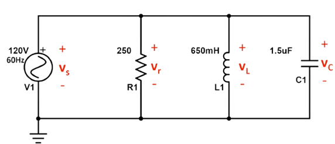
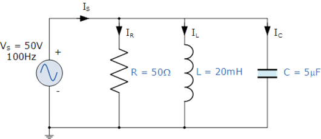
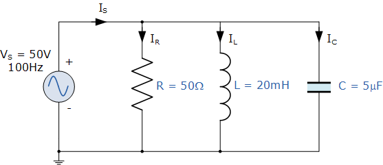

## Post Test 
#### Please attempt the following questions

### Note- Reference books are available in the reference section.

 

 
Q1. For the following circuit. Calculate the magnitude of the impedance?

A. 187.97

B. 192.18

C. 76.22

D. 201.87
 
Q2. For the following circuit. Calculate the phase angle of the impedance?

A. 41.3

B. 32.5

C. 60.3

D. 55.1
 
Q3. For the following circuit. Calculate the magnitude of the phase current?

A. 0.228 A

B. 0.345 A

C. 0.639 A

D. 0.541 A
 
Q4. Two impedance given by Zn=(10+j5) and Z2(8+J6) are joined in parallel and connected across a voltage of v=200+j0.Calculate the circuit current.

A. 35.74&ang;-28&deg;

B. 37.74&ang;-32&deg;

C. 32.74&ang;-32&deg;

D. 32.14&ang;-65&deg;
 
Q5. For a parallel RLC circuit with a 16Ω resistor, 8Ω inductor, 20Ω capacitor, and a 120V power supply. Find the source current?

A. 11.71 A

B. 23.22 A

C. 10.91 A

D. 9.89 A
 
Q6. While drawing the vector diagram for a series circuit, the reference vector is?

A. Voltage

B. Current

C. Power

D. Phase angle
 
Q7. For the following parallel RLC circuit. Find the conductance(S)?

A. 0.001

B. 0.002

C. 0.003

D. 0.004
 
Q8. For the following parallel RLC circuit. Calculate the admittance(S)?

A. 0.089

B. 0.0455

C. 0.078

D. 0.092
 
Q9. For the following parallel RLC circuit. Calculate the source current(in A)?

A. 3.87

B. 4.12

C. 1.27

D. 2.92
 
Q10. For the following parallel RLC circuit. Calculate the power factor?

A. 0.96 lead

B. 0.96 lag

C. 0.25 lead

D. 0.25 lag

