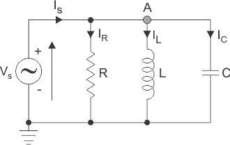

# Parallel RLC Circuit 

### Theory

We have the three basic passive components Resistance, capacitance and Inductance. When connected to a sinusoidal alternating voltage source they have different phase relationship with each other. But we can connect these passive elements together to form a parallel RLC circuit in parallel with an applied voltage supply.

Figure 1: Parallel RLC Circuit

 

In a pure ohmic resistor the current waveforms are **"in-phase"** with the voltage. In a pure inductance the current waveform **"lags"** the voltage by 90° and in a pure capacitance the current waveform **"leads"** the by 90°.

The parallel RLC circuit above has a single node so the same instantaneous voltage will be across each element. Here the inductive and capacitive reactance  $X_L $ and  $X_C $ are functions of supply frequency so the sinusoidal response of the parallel RLC circuit will vary with the frequency f. Then the individual voltage drops across each circuit element of R, L and C element will be **"out-of-phase"** with each other as defined by:

 

 
 $V(t) = V~max~ sin(ωt) $ 

 

The instantaneous current through a pure resistor,  $I_R $ is **"in-phase"** with current. The instantaneous current through a pure inductor,  $I_L $ **"lags"** the current by 90°. The instantaneous current through a pure capacitor,  $I_C $ **"leads"** the current by 90°. Therefore,  $I_L $ and  $I_C $ are 180° **"out-of-phase"** and in opposition to each other.

For above parallel circuit amplitude of the source current across all three components in a parallel RLC circuit is made up of the three individual component currents,  $I_R $,  $I_L $ and  $I_C $ with the voltage as common to all three currents. Therefore, the vector diagram will be drawn as voltage vector as reference and the three currents will be plotted with this reference. We cannot simply add the three currents as they are vector quantities to find the supply voltage  $I_S $. So, to find the supply the current  $I_S $ we need to phasor sum of the three component currents.

By applying KCL in the circuit

 
 $I_S - I_R - I_L- I_C= 0 $

 
 $I_S - \frac{1} {RL} ∫Vdt- C \frac{dV} {dt}=0 $

 
 $V_S =IR+ \frac{1}{L} ∫Vdt+C \frac{dV} {dt} ........(1) $

 

As the voltage across circuit is common to the all three circuit elements we can use this as a reference vector with the three currents vector drawn relative to the reference voltage vector.

The resulting vector  $I_S$ is obtained by adding $I_L$ and $I_C$ and the adding this sum to the remaining vector IR. The angle obtained between $I_S $ and  $V_S $ will be the circuit phase angle as shown below.

Figure 2: Current Triangle

This triangle obtained is also called current triangle. Here, Magnitude of voltage,

 
 $|I_S|= \sqrt{(I_R)^2+(I_L-I_C)^2 } ........(2) $

Voltage has same phase and amplitude in all components of parallel RLC circuit so current through each component can be described mathematically according to the volage across each element as shown below:

 
 $ I_R= \frac{V}{R} sin(ωt+0°) $

 
 $I_L= \frac {V}{X_L} sin(ωt-90°)= \frac{V}{jwL} $

 
 $I_C= \frac{V}{X_C} sin(ωt+90°)=Vjωc $

 By substituting these values into the voltage triangle equation above-

 
 $I_R= \frac{V}{R},I_L= \frac{V} {X_L} , I_C= \frac{V} {X_C} $

 
 $I_S=\sqrt{(\frac{V}{R})^2+ (\frac{V}{X_L} -\frac{V}{X_C} )^2 } $

 
 $I_S=\frac{V} {\sqrt{(R)^2+ (X_L-X_C )^2 }} $

On comparing this equation with the equation 1 we can obtain the admittance triangle

Figure 3: Admittance Triangle

The admittance Y of the parallel RLC circuit depends on the frequency ω as $X_L$ & $X_C$ also depends on it. The admittance of circuit can be written as-

 $Admittance, Y=\frac{1} {Z}=\frac{1}{\sqrt{R^2+ (ωL-\frac{1}{ωC})^2 }}  ........(3)  $

 
The phase angle, Ø between the source voltage $V_S$ and the current I is the same as the angle between Z and R in the impedance triangle.

The impedance Z has two component resistance, R and reactance, X. Similarly, admittance also has two components such as conductance, G (reciprocal of resistance, R) and susceptance, B (reciprocal of reactance, X). So admittance triangle of parallel RLC circuit is completely opposite to that of series impedance triangle. From the admittance triangle phase angle can be calculated as

 $Power factor , Cos∅=\frac{G}{Y} ........(4)$

 $tan∅=\frac{B}{G} $

Admittance, Y = G - jB for parallel circuits where the real part G is the conductance and the imaginary part jB is the susceptance. In polar form this will be given as:

 
 $Y=G+jB=\sqrt{G^2+B^2 }∠\frac{B}{G} $

Further, power in the circuit can be calculated as,

 $Apparent Power, S=VI $

 $Active Power, P=VI cos∅ $

 $Reactive Power, Q= VI sin∅ $

### Advantages of Parallel RLC circuit

 *  Every unit that is connected in a parallel circuit gets equal amount of voltage.

 *  It becomes easy to connect or disconnect a new element without affecting the working of other elements.

 *  The delta connected load, need not to be opened for connecting the wattmeters.

### Disadvantages of Parallel RLC circuit

 *  It requires the use of lot of wires.

 *  We cannot increase or multiply the voltage in a parallel circuit.

 *  Parallel connection fails at the time when it is required to pass exactly same amount of current through the units.

