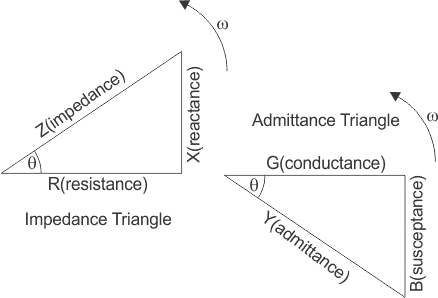

# Parallel RLC Circuit 

### Theory

A parallel RLC circuit consists of a resistor (R), an inductor (L), and a capacitor (C) connected in parallel across a voltage source. This configuration forms a fundamental component in AC circuit analysis, with applications in tuning circuits, signal processing, and power systems.

Figure 1: Parallel RLC Circuit

 

In a parallel circuit, the voltage across each component remains the same, while the currents flowing through them differ. This parallel arrangement affects the overall impedance and current distribution in the circuit, distinguishing it from a series circuit. Therefore, for convenience, the voltage may be taken as a reference phasor, and all the currents, i.e., IR, IC, and IL, are drawn relative to this voltage vector V. The current through each element can be found using Kirchhoff’s Current Law, which states that the sum of currents entering a junction or node equals the sum of currents leaving that node.

 

Figure 2: Current Triangle

This triangle is also called the current triangle.Here, the magnitude of the current,

$|I_S| = \sqrt{(I_R)^2 + (I_L - I_C)^2} \quad ........(1)$

Where Is is the supply current in amps.

IR is the current flowing in the resistor(R) in amps.

IL is the current flowing in the inductor (L) in amps.
IC is the current flowing in the capacitor (C) in amps.

Therefore, the current through each component can be described according to the voltage across each element as shown below:

 

$|I_R|= \frac {V}{R}, I_L=\frac{V}{x_L}, I_C=\frac{V}{X_C}$

By substituting the IR,IL and IC in eq. (1)

$ I_S=\sqrt{(\frac {V}{R})^2+(\frac{V}{X_L}-\frac{V}{X_C})^2}$

<b>Admittance (Y):</b> Admittance is the reciprocal of impedance. It represents the ease with which an electric current flows through a circuit and is a measure of how effectively the circuit conducts electricity. The unit of admittance is siemens (S). 

So, admittance can be expressed as  

$\frac{1}{Z}=\frac{I_S}{V}=Y=\sqrt{\frac{1}{R^2}+(\frac{1}{X_L}-\frac{1}{X_C})^2} .............(2)$

The impedance (Z) of the circuit is given by

$Z = \frac{1}{\sqrt{\left(\frac{1}{R}\right)^2 + \left(\frac{1}{X_L} - \frac{1}{X_C}\right)^2}} \quad ..........(3)$    

Figure 3: Admittance Triangle

From the admittance triangle power factor and phase angle can be calculated as 

Power Factor, $cos \phi=\frac{G}{Y}.........(4)$ 

Where G is conductance which is the reciprocal of electrical resistance(R) and the unit of conductance is siemens(S).

Mathematically, $G=\frac{1}{R}$, where R is the resitance in ohms(&Omega;).

$\phi=cos^{-1}(\frac{G}{Y}).............(5)$  

### Advantages of Parallel RLC circuit

* Every unit connected in a parallel circuit receives an equal amount of   voltage.
* It is easy to connect or disconnect a new element without affecting the operation of other elements.
* The delta-connected load does not need to be opened to connect the wattmeters.

### Disadvantages of Parallel RLC circuit

* Parallel connection fails when it is necessary to pass the same amount of current through all the elements.
* It requires the use of a lot of wires.
* Voltage cannot be increased or multiplied in a parallel circuit.

